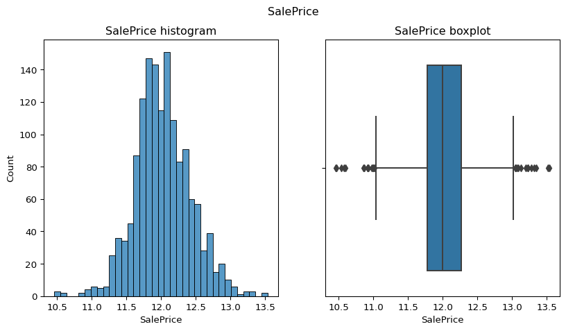
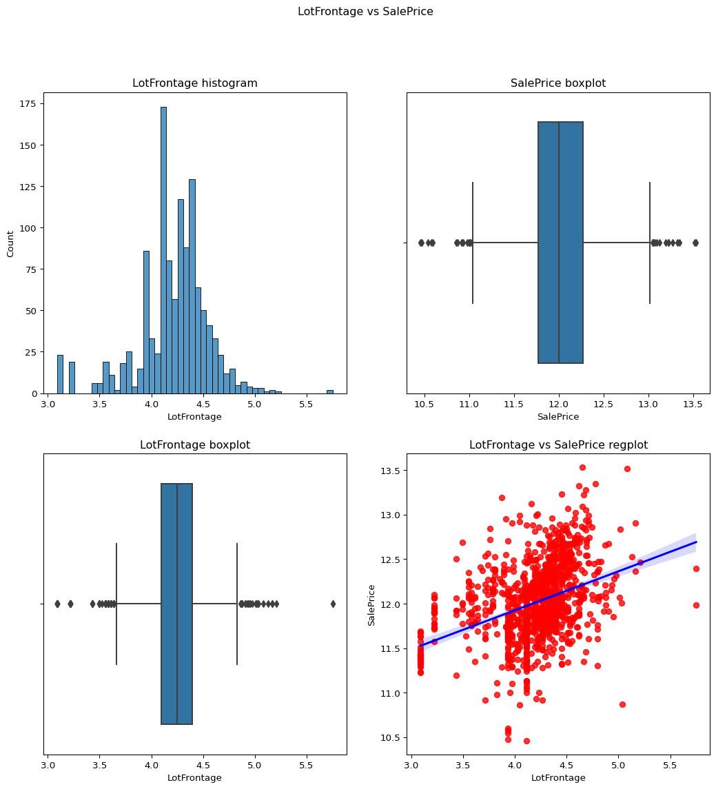
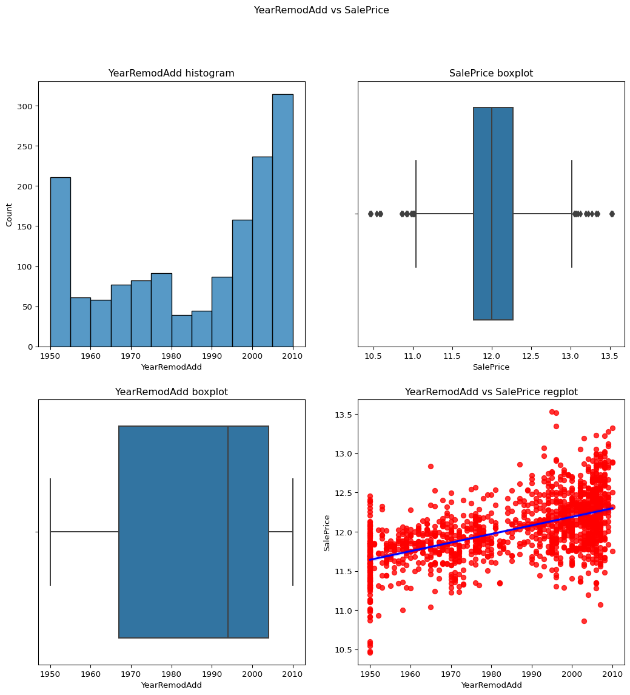
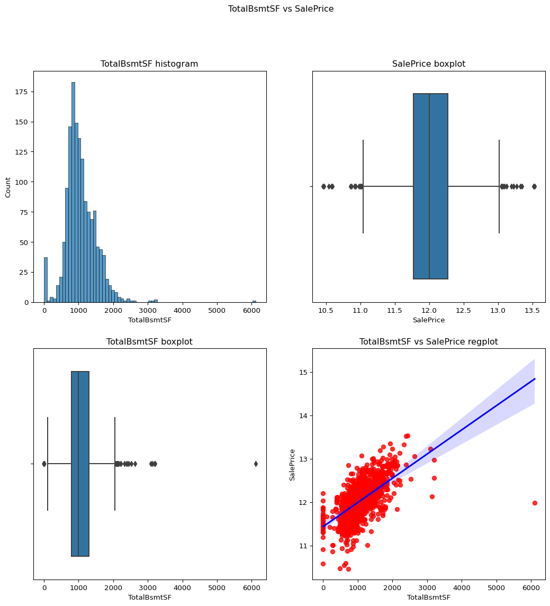
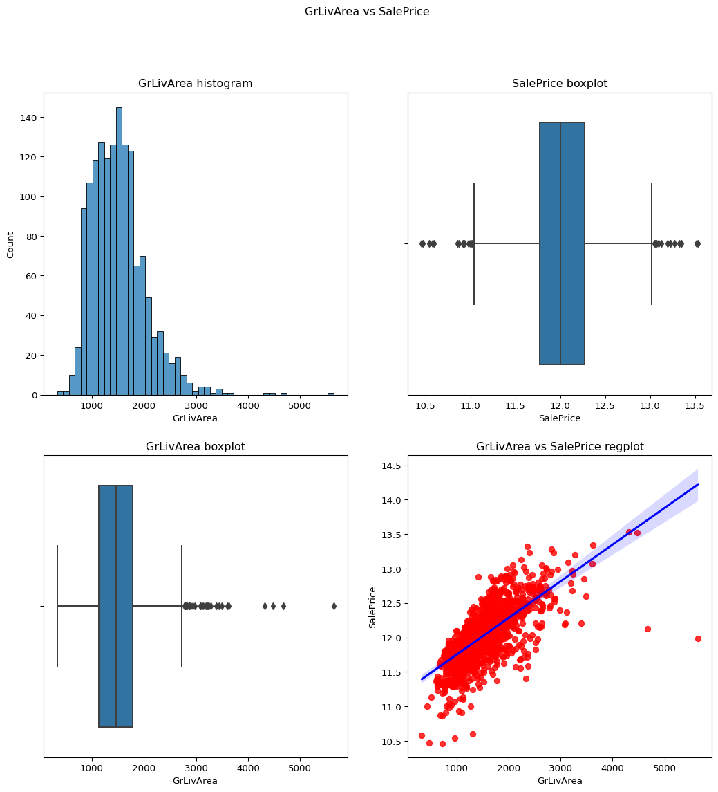
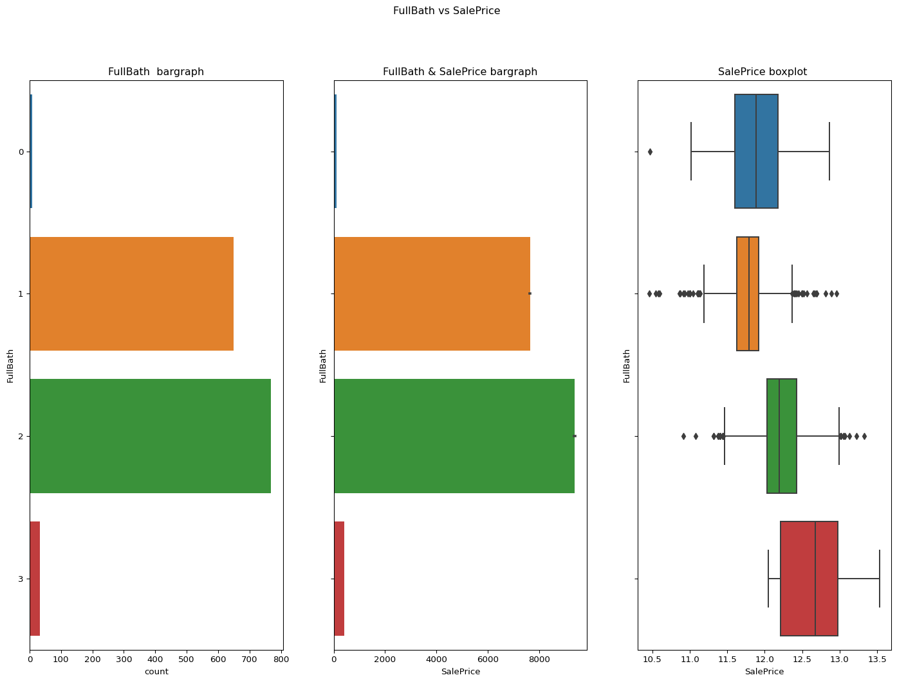
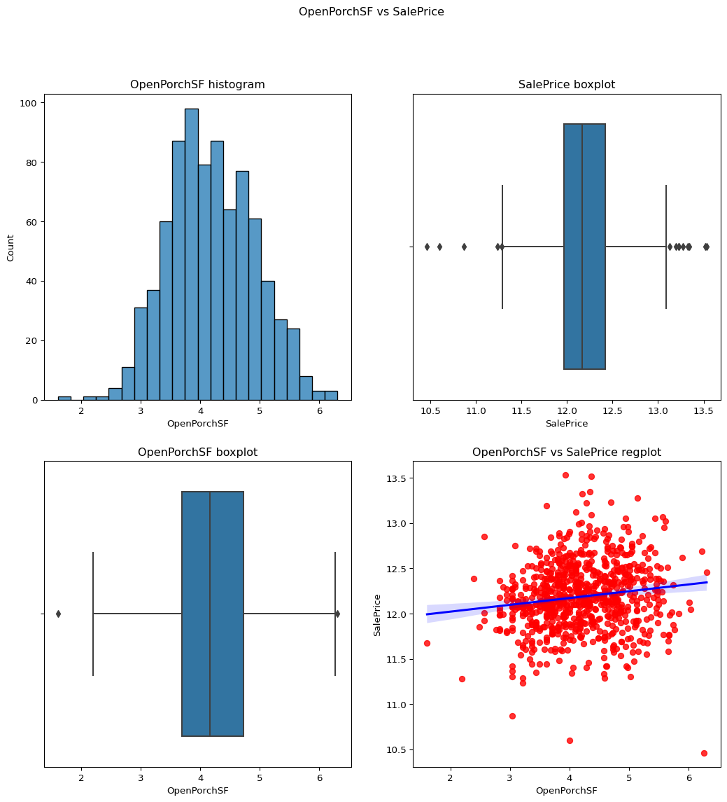
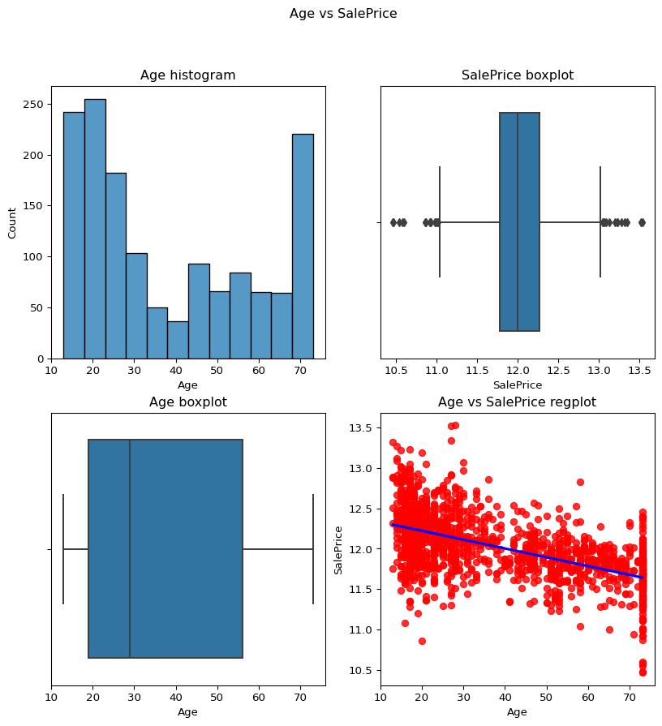
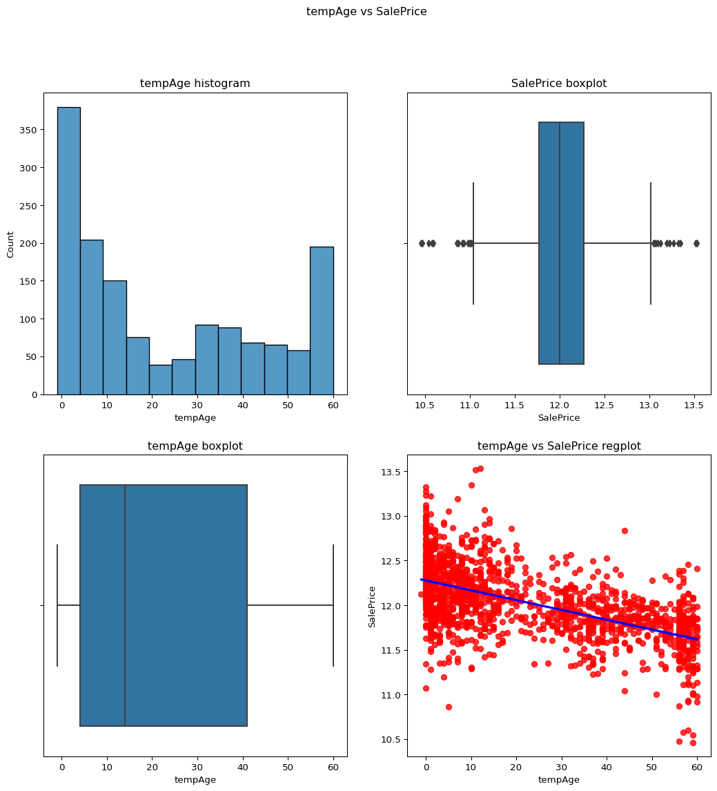

# Orion Summer Internship (House Price Prediction Model)
Kaustubh S Nair
2023-06-30

- [🎯The AMES (Advanced Estate Management
  System)](#the-ames-advanced-estate-management-system)
- [🎯PRE-PROCESSING & EDA :](#pre-processing-eda)
  - [Columns with NO Missing_Values](#columns-with-no-missing_values)
  - [Target:SalePrie](#targetsaleprie)
  - [MSSubClass](#mssubclass)
  - [LotFrontage](#lotfrontage)
  - [LotArea](#lotarea)
  - [YearBuilt](#yearbuilt)
  - [YearRemodAdd](#yearremodadd)
  - [YearRemodAdd vs YearBuilt](#yearremodadd-vs-yearbuilt)
  - [MasVnrArea](#masvnrarea)
  - [BsmtFinSF1–](#bsmtfinsf1)
  - [BsmtFinSF2: Type 2 finished square
    feet](#bsmtfinsf2-type-2-finished-square-feet)
  - [TotalBsmtSF: Total square feet of
    basement](#totalbsmtsf-total-square-feet-of-basement)
  - [GrLivArea: Above grade (ground) living area square
    feet](#grlivarea-above-grade-ground-living-area-square-feet)
  - [FullBath: Full bathrooms above
    grade](#fullbath-full-bathrooms-above-grade)
  - [BedroomAbvGr: Bedrooms above
    grade](#bedroomabvgr-bedrooms-above-grade)
  - [KitchenAbvGr: Kitchens above
    grade](#kitchenabvgr-kitchens-above-grade)
  - [TotRmsAbvGrd: Total rooms above grade (does not include
    bathrooms)](#totrmsabvgrd-total-rooms-above-grade-does-not-include-bathrooms)
  - [Fireplaces: Number of fireplaces](#fireplaces-number-of-fireplaces)
  - [GarageCars: Size of garage in car
    capacity](#garagecars-size-of-garage-in-car-capacity)
  - [GarageArea: Size of garage in square
    feet](#garagearea-size-of-garage-in-square-feet)
  - [garagecars vs garage area](#garagecars-vs-garage-area)
  - [OpenPorchSF: Open porch area in square
    feet(best)](#openporchsf-open-porch-area-in-square-feetbest)
  - [ScreenPorch: Screen porch area in square
    feet](#screenporch-screen-porch-area-in-square-feet)
  - [current age of the buildings according to the
    YearRemodAdd](#current-age-of-the-buildings-according-to-the-yearremodadd)
  - [Age of the building acc to the
    yearsold](#age-of-the-building-acc-to-the-yearsold)
  - [garage year built](#garage-year-built)
- [🎯TRAINING AND EVALUATION :](#training-and-evaluation)
  - [Select the variables that are Nominal from
    var_dsc](#select-the-variables-that-are-nominal-from-var_dsc)
  - [Select the variables that are Ordinal from
    var_dsc](#select-the-variables-that-are-ordinal-from-var_dsc)
  - [Select the variables that are Continuous from
    var_dsc](#select-the-variables-that-are-continuous-from-var_dsc)
  - [Creating arguments for the function to be
    used](#creating-arguments-for-the-function-to-be-used)
  - [Dropping the columns with the most missing
    ratio](#dropping-the-columns-with-the-most-missing-ratio)
  - [Applying labelencoding , one hot encoding and log tranfromation on
    the above generated
    lists](#applying-labelencoding-one-hot-encoding-and-log-tranfromation-on-the-above-generated-lists)
  - [Splitting the data](#splitting-the-data)
- [MODEL 1 :](#model-1)
  - [Scores](#scores)
- [MODEL 2 :](#model-2)
  - [Scores of the RandomForest
    Regression](#scores-of-the-randomforest-regression)
- [➡️CONCLUSION :](#conclusion)

# 🎯The AMES (Advanced Estate Management System)

House Prediction Regression Model is a machine learning-based system
designed to accurately predict house prices. The model leverages
regression algorithms and advanced data analysis techniques to estimate
the monetary value of residential properties based on a variety of input
features. By analyzing historical data and learning from patterns, the
AEMS model aims to provide reliable and precise predictions,
facilitating informed decision-making in the real estate industry.The
model incorporates various stages of data preprocessing and feature
engineering to handle missing values, outliers, and transform variables
into a suitable format for regression analysis. Techniques such as log
transformation, one-hot encoding, and label encoding are applied to
ensure the optimal representation of the data. The model also employs
advanced regression algorithms, such as linear regression, decision
trees, random forests, or gradient boosting, to capture complex
relationships and accurately estimate house prices.

<details>
<summary>Code</summary>

``` python
import os
from dotenv import load_dotenv

load_dotenv()  # take environment variables from .env.
#ROOT_DIR1 =  os.environ.get("ROOT_DIR") 
#print(ROOT_DIR1)
ROOT_DIR =  os.environ.get("ROOT_DIR2") 
```

</details>
<details>
<summary>Code</summary>

``` python
import os
os.chdir(ROOT_DIR)
import numpy as np
import pandas as pd
import seaborn as sb
from sklearn.preprocessing import LabelEncoder
from src.util import catgvssale,contvssale,contvscont,check_column_skewness,remove_skewness,plot_contv,remove_ngskewness,log_transform_continuous,one_hot_encode_nominal,label_encode_dataset,preprocess_dataset
from datetime import datetime
df = pd.read_csv( "data/raw/train.csv")
temp_df=df
```

</details>

# 🎯PRE-PROCESSING & EDA :

EDA (Exploratory Data Analysis) and preprocessing play crucial roles in
the development of the AEMS House Prediction Regression Model. These
stages involve thorough analysis, cleaning, and transformation of the
dataset to ensure optimal data quality and feature representation.
Analyze the distribution of numerical features and address skewness or
non-normality by applying transformations like log
transformation.Convert categorical variables into numerical
representations using one-hot encoding or label encoding techniques,
depending on the nature and cardinality of the variables.

<details>
<summary>Code</summary>

``` python
numerics =['int16','int32','int64','float16','float32','float64']
numcol = df.select_dtypes(include=numerics)
len(numcol)
numcol
```

</details>
<div>
<style scoped>
    .dataframe tbody tr th:only-of-type {
        vertical-align: middle;
    }
&#10;    .dataframe tbody tr th {
        vertical-align: top;
    }
&#10;    .dataframe thead th {
        text-align: right;
    }
</style>

|      | Id   | MSSubClass | LotFrontage | LotArea | OverallQual | OverallCond | YearBuilt | YearRemodAdd | MasVnrArea | BsmtFinSF1 | ... | WoodDeckSF | OpenPorchSF | EnclosedPorch | 3SsnPorch | ScreenPorch | PoolArea | MiscVal | MoSold | YrSold | SalePrice |
|------|------|------------|-------------|---------|-------------|-------------|-----------|--------------|------------|------------|-----|------------|-------------|---------------|-----------|-------------|----------|---------|--------|--------|-----------|
| 0    | 1    | 60         | 65.0        | 8450    | 7           | 5           | 2003      | 2003         | 196.0      | 706        | ... | 0          | 61          | 0             | 0         | 0           | 0        | 0       | 2      | 2008   | 208500    |
| 1    | 2    | 20         | 80.0        | 9600    | 6           | 8           | 1976      | 1976         | 0.0        | 978        | ... | 298        | 0           | 0             | 0         | 0           | 0        | 0       | 5      | 2007   | 181500    |
| 2    | 3    | 60         | 68.0        | 11250   | 7           | 5           | 2001      | 2002         | 162.0      | 486        | ... | 0          | 42          | 0             | 0         | 0           | 0        | 0       | 9      | 2008   | 223500    |
| 3    | 4    | 70         | 60.0        | 9550    | 7           | 5           | 1915      | 1970         | 0.0        | 216        | ... | 0          | 35          | 272           | 0         | 0           | 0        | 0       | 2      | 2006   | 140000    |
| 4    | 5    | 60         | 84.0        | 14260   | 8           | 5           | 2000      | 2000         | 350.0      | 655        | ... | 192        | 84          | 0             | 0         | 0           | 0        | 0       | 12     | 2008   | 250000    |
| ...  | ...  | ...        | ...         | ...     | ...         | ...         | ...       | ...          | ...        | ...        | ... | ...        | ...         | ...           | ...       | ...         | ...      | ...     | ...    | ...    | ...       |
| 1455 | 1456 | 60         | 62.0        | 7917    | 6           | 5           | 1999      | 2000         | 0.0        | 0          | ... | 0          | 40          | 0             | 0         | 0           | 0        | 0       | 8      | 2007   | 175000    |
| 1456 | 1457 | 20         | 85.0        | 13175   | 6           | 6           | 1978      | 1988         | 119.0      | 790        | ... | 349        | 0           | 0             | 0         | 0           | 0        | 0       | 2      | 2010   | 210000    |
| 1457 | 1458 | 70         | 66.0        | 9042    | 7           | 9           | 1941      | 2006         | 0.0        | 275        | ... | 0          | 60          | 0             | 0         | 0           | 0        | 2500    | 5      | 2010   | 266500    |
| 1458 | 1459 | 20         | 68.0        | 9717    | 5           | 6           | 1950      | 1996         | 0.0        | 49         | ... | 366        | 0           | 112           | 0         | 0           | 0        | 0       | 4      | 2010   | 142125    |
| 1459 | 1460 | 20         | 75.0        | 9937    | 5           | 6           | 1965      | 1965         | 0.0        | 830        | ... | 736        | 68          | 0             | 0         | 0           | 0        | 0       | 6      | 2008   | 147500    |

<p>1460 rows × 38 columns</p>
</div>
<details>
<summary>Code</summary>

``` python
missingper = df.isna().sum().sort_values(ascending=False)/len(df)
missingper.head(10)
miss_col = missingper[missingper!=0]
miss_col
miss_col.head(19)
```

</details>

    PoolQC          0.995205
    MiscFeature     0.963014
    Alley           0.937671
    Fence           0.807534
    MasVnrType      0.597260
    FireplaceQu     0.472603
    LotFrontage     0.177397
    GarageYrBlt     0.055479
    GarageCond      0.055479
    GarageType      0.055479
    GarageFinish    0.055479
    GarageQual      0.055479
    BsmtFinType2    0.026027
    BsmtExposure    0.026027
    BsmtQual        0.025342
    BsmtCond        0.025342
    BsmtFinType1    0.025342
    MasVnrArea      0.005479
    Electrical      0.000685
    dtype: float64

## Columns with NO Missing_Values

<details>
<summary>Code</summary>

``` python
nomiss_col = missingper[missingper == 0]
nomiss_col
nomiss_col.info()
nomiss_col.head(15)
```

</details>

    <class 'pandas.core.series.Series'>
    Index: 62 entries, Id to SalePrice
    Series name: None
    Non-Null Count  Dtype  
    --------------  -----  
    62 non-null     float64
    dtypes: float64(1)
    memory usage: 992.0+ bytes

    Id              0.0
    Functional      0.0
    Fireplaces      0.0
    KitchenQual     0.0
    KitchenAbvGr    0.0
    BedroomAbvGr    0.0
    HalfBath        0.0
    FullBath        0.0
    BsmtHalfBath    0.0
    TotRmsAbvGrd    0.0
    GarageCars      0.0
    GrLivArea       0.0
    GarageArea      0.0
    PavedDrive      0.0
    WoodDeckSF      0.0
    dtype: float64

## Target:SalePrie

<details>
<summary>Code</summary>

``` python
#plot_contv(contvar="SalePrice",df=df)
remove_skewness(df,"SalePrice")
check_column_skewness(df,"SalePrice")
plot_contv(contvar="SalePrice",df=df)
```

</details>



## MSSubClass

<details>
<summary>Code</summary>

``` python
catgvssale(catgvar="MSSubClass",df=df)
check_column_skewness(df,"MSSubClass")
```

</details>

    1.4076567471495591


## LotFrontage

Checking the skewness of a temporary df which does not include the
values of the column LotFrontage which has value 0 and plotting it
against the salePrice to check whether it is suitable for the model or
not.

Skewness before log transform is 2.1635691423248837.

Now removing the skewness and checking the value againa and plotting it
again to see the difference.

Skewness atfer log transform = -0.7287278423055492

<details>
<summary>Code</summary>

``` python
temp_df = df.loc[df['LotFrontage']!=0]
remove_skewness(temp_df,"LotFrontage")
check_column_skewness(temp_df,"LotFrontage")
contvssale(contvar="LotFrontage",df=temp_df)
```

</details>



## LotArea

Skewness = -0.1374044.

The value is acceptable as it has already been transformed using the log
transformation.

<details>
<summary>Code</summary>

``` python
remove_skewness(temp_df,"LotArea")
contvssale(contvar="LotArea",df=temp_df)
```

</details>


## YearBuilt

Skewness = -0.6134611.

As the skewness of the column is already less than 1 there is no need to
apply the log transformation.

<details>
<summary>Code</summary>

``` python
contvssale(contvar="YearBuilt",df=temp_df)
check_column_skewness(temp_df,"YearBuilt")
```

</details>

    -0.613461172488183


## YearRemodAdd

Skewness=-0.503562002.

As from the below countplot, boxplot and regplot we can see that this
data is not skewed.

<details>
<summary>Code</summary>

``` python
contvssale(contvar="YearRemodAdd",df=df)
```

</details>



## YearRemodAdd vs YearBuilt

<details>
<summary>Code</summary>

``` python
contvscont(contvar="YearBuilt",df=df,tarvar="YearRemodAdd")
```

</details>


## MasVnrArea

Skewness = 2.677616.

From the below graph we can see that this data is a little positively
skewed so we can apply here log transformation.

Skewness after = 0.50353171.

<details>
<summary>Code</summary>

``` python
op = remove_skewness(df,"MasVnrArea")
check_column_skewness(df,"MasVnrArea")
contvssale(contvar="MasVnrArea",df=df)
```

</details>


## BsmtFinSF1–

Skewness = 1.685503071910789.

From the regression plot as well as boxplot we can say that this data is
slightly skewed as it has more confidence in the regression plot.

Skewness = -0.618409817855514.

<details>
<summary>Code</summary>

``` python
remove_skewness(df,"BsmtFinSF1")
check_column_skewness(df,"BsmtFinSF1")
temp_df = df.loc[df['BsmtFinSF1']!=0]
contvssale(contvar="BsmtFinSF1",df=temp_df)
check_column_skewness(temp_df,"BsmtFinSF1")
```

</details>

    -1.8212926673745269


## BsmtFinSF2: Type 2 finished square feet

Skewness = 4.255261108933303.

The data is positively skewed and may impact our model so we apply log
transform. skewness = 2.434961825856814. After removing the 0 values we
get the column with skewness which is less than 1. skewness =
0.9942372017307054

<details>
<summary>Code</summary>

``` python
remove_skewness(df,"BsmtFinSF2")
check_column_skewness(df,"BsmtFinSF2")
temp_df = df.loc[df['BsmtFinSF2']!=0]
contvssale(contvar="BsmtFinSF2",df=temp_df)
check_column_skewness(temp_df,"BsmtFinSF2")
```

</details>

    -0.5937670428573839


## TotalBsmtSF: Total square feet of basement

skewness = 1.5242545490627664

<details>
<summary>Code</summary>

``` python
contvssale(contvar="TotalBsmtSF",df=df)
```

</details>



## GrLivArea: Above grade (ground) living area square feet

Skewness = 1.3665603560164552.

The skewness of this data is accepable so no need to apply the log
transfrom as it would make it negatively skewed.

<details>
<summary>Code</summary>

``` python
contvssale(contvar="GrLivArea",df=df)
check_column_skewness(df,"GrLivArea")
```

</details>

    1.3665603560164552



## FullBath: Full bathrooms above grade

From the regression plot as well as the boxplot we can conclude that the
data is not skewed.

It is a descrete variable as well.

Skewness = 0.036561558402727165

<details>
<summary>Code</summary>

``` python
check_column_skewness(df,"FullBath")
catgvssale(catgvar="FullBath",df=df)
```

</details>



## BedroomAbvGr: Bedrooms above grade

It appears as a continuous column but according to its bar graph it is
clear that it is descrete.

<details>
<summary>Code</summary>

``` python
catgvssale(catgvar="BedroomAbvGr",df=df)
```

</details>


## KitchenAbvGr: Kitchens above grade

<details>
<summary>Code</summary>

``` python
catgvssale(catgvar="KitchenAbvGr",df=df)
```

</details>


## TotRmsAbvGrd: Total rooms above grade (does not include bathrooms)

From the below info we can see that the data is under the skew limit and
the graph is normal.

Skewness = 0.6763408364355531

<details>
<summary>Code</summary>

``` python
check_column_skewness(df,"TotRmsAbvGrd")
catgvssale(catgvar="TotRmsAbvGrd",df=df)
```

</details>


## Fireplaces: Number of fireplaces

The data is under the skewness limit of 1.

It can be seen from the graphs as well.

skewness = 0.6495651830548841

<details>
<summary>Code</summary>

``` python
contvssale(contvar="Fireplaces",df=df)
check_column_skewness(df,"Fireplaces")
catgvssale(catgvar="Fireplaces",df=df)
```

</details>


## GarageCars: Size of garage in car capacity

From the below visualization it can be predicted that this data column
is not skewed its normal.

skewness = -0.3425489297486655

<details>
<summary>Code</summary>

``` python
contvssale(contvar="GarageCars",df=df)
check_column_skewness(df,"GarageCars")
catgvssale(catgvar="GarageCars",df=df)
```

</details>


## GarageArea: Size of garage in square feet

skewness = 0.17998090674623907

Data column is acceptable.

<details>
<summary>Code</summary>

``` python
contvssale(contvar="GarageArea",df=df)
check_column_skewness(df,"GarageArea")
```

</details>

    0.17998090674623907


## garagecars vs garage area

<details>
<summary>Code</summary>

``` python
contvscont(contvar="GarageArea",df=df,tarvar="GarageCars")
```

</details>


## OpenPorchSF: Open porch area in square feet(best)

skewness = 2.3643417403694404

skewness after = -0.02339729485739231

<details>
<summary>Code</summary>

``` python
check_column_skewness(df,"OpenPorchSF")
remove_skewness(df,"OpenPorchSF")
temp_df=temp_df = df.loc[df['OpenPorchSF']!=0]
contvssale(contvar="OpenPorchSF",df=temp_df)
```

</details>



## ScreenPorch: Screen porch area in square feet

Skewness before transform = 4.122213743143115

Just after removing the 0 values the skewness came upto
1.186468489847003.

After removing the skewness values of the temp_df we get it -0.40 .

<details>
<summary>Code</summary>

``` python
check_column_skewness(df,"ScreenPorch")
temp_df=temp_df = df.loc[df['ScreenPorch']!=0]
contvssale(contvar="ScreenPorch",df=temp_df)
check_column_skewness(temp_df,"ScreenPorch")
```

</details>

    1.186468489847003


## current age of the buildings according to the YearRemodAdd

<details>
<summary>Code</summary>

``` python
temp_df = df
current_year = datetime.now().year

temp_df['Age']= current_year-df['YearRemodAdd']
#print(temp_df)
temp_df['Age']
contvscont(contvar='Age',df=temp_df,tarvar='SalePrice')
```

</details>



## Age of the building acc to the yearsold

<details>
<summary>Code</summary>

``` python
temp_df['tempAge']= df['YrSold']-df['YearRemodAdd']
#print(temp_df)
temp_df['tempAge']
contvssale(contvar="tempAge",df=temp_df)
```

</details>



## garage year built

<details>
<summary>Code</summary>

``` python
temp_df = df
current_year = datetime.now().year

temp_df['GarAgeYr']= current_year-df['GarageYrBlt']
temp_df['GarAgeYr']
contvssale(contvar='GarAgeYr',df=temp_df)
```

</details>


# 🎯TRAINING AND EVALUATION :

Split the preprocessed dataset into training and testing sets to
evaluate the model’s performance on unseen data.Ensure proper
stratification if the dataset is imbalanced or if specific classes or
categories need to be represented equally in both sets.

<details>
<summary>Code</summary>

``` python
import numpy as np
import pandas as pd
import matplotlib.pyplot as plt
import seaborn as sb
from sklearn.preprocessing import LabelEncoder
from src.util import catgvssale,contvssale,contvscont,check_column_skewness,remove_skewness,plot_contv,remove_ngskewness,preprocess_dataset
from datetime import datetime
from scipy.stats import skew
from sklearn.linear_model import Lasso
from sklearn.preprocessing import StandardScaler
from sklearn.feature_selection import SelectPercentile, chi2
from sklearn.linear_model import LinearRegression
from sklearn.metrics import r2_score
from sklearn.metrics import mean_squared_error
import pickle
```

</details>
<details>
<summary>Code</summary>

``` python
final_df = pd.read_csv('data/raw/train.csv')
df1 =  pd.read_csv('data/raw/train.csv')
lbl_dsc = pd.read_csv('data\clean\label_description.csv')
var_dsc =  pd.read_csv('data/clean/variable_description.csv')
```

</details>

## Select the variables that are Nominal from var_dsc

From the variable description file we are collecting only the variables
that are nominal so that we can add it to the list of nominal data.

<details>
<summary>Code</summary>

``` python
nominal_df = var_dsc.loc[var_dsc['variable_type'] == 'Nominal']
#print(ordinal_df)
#nominal_df.head(30)
nominal_list = nominal_df['variable'].to_list()
print(nominal_list)
nominal_list.remove("MiscFeature")
nominal_list.remove("Alley")
nominal_list.remove("MSSubClass")
print(nominal_list)
```

</details>

    ['MSSubClass', 'MSZoning', 'Street', 'Alley', 'LandContour', 'LotConfig', 'Neighborhood', 'Condition1', 'Condition2', 'BldgType', 'HouseStyle', 'RoofStyle', 'RoofMatl', 'Exterior1st', 'Exterior2nd', 'MasVnrType', 'Foundation', 'Heating', 'CentralAir', 'GarageType', 'MiscFeature', 'SaleType', 'SaleCondition']
    ['MSZoning', 'Street', 'LandContour', 'LotConfig', 'Neighborhood', 'Condition1', 'Condition2', 'BldgType', 'HouseStyle', 'RoofStyle', 'RoofMatl', 'Exterior1st', 'Exterior2nd', 'MasVnrType', 'Foundation', 'Heating', 'CentralAir', 'GarageType', 'SaleType', 'SaleCondition']

## Select the variables that are Ordinal from var_dsc

From the variable description file we are collecting only the variables
that are ordinal so that we can add it to the list of ordinal data.

<details>
<summary>Code</summary>

``` python
ordinal_df = var_dsc.loc[var_dsc['variable_type'] == 'Ordinal']
#print(ordinal_df)
ordinal_df.head(24)
ordinal_list = ordinal_df['variable'].to_list()
print(ordinal_list)
ordinal_list.remove("PoolQC")
ordinal_list.remove("Fence")
print(ordinal_list)
```

</details>

    ['LotShape', 'Utilities', 'LandSlope', 'OverallQual', 'OverallCond', 'ExterQual', 'ExterCond', 'BsmtQual', 'BsmtCond', 'BsmtExposure', 'BsmtFinType1', 'BsmtFinType2', 'HeatingQC', 'Electrical', 'KitchenQual', 'Functional', 'FireplaceQu', 'GarageFinish', 'GarageQual', 'GarageCond', 'PavedDrive', 'PoolQC', 'Fence']
    ['LotShape', 'Utilities', 'LandSlope', 'OverallQual', 'OverallCond', 'ExterQual', 'ExterCond', 'BsmtQual', 'BsmtCond', 'BsmtExposure', 'BsmtFinType1', 'BsmtFinType2', 'HeatingQC', 'Electrical', 'KitchenQual', 'Functional', 'FireplaceQu', 'GarageFinish', 'GarageQual', 'GarageCond', 'PavedDrive']

## Select the variables that are Continuous from var_dsc

From the variable description file we are collecting only the variables
that are continuous so that we can add it to the list of continuous
data.

<details>
<summary>Code</summary>

``` python
cont_df = var_dsc.loc[var_dsc['variable_type'] == 'Continuous']
cont_list = cont_df['variable'].to_list()
print(cont_list)
```

</details>

    ['LotFrontage', 'LotArea', 'MasVnrArea', 'BsmtFinSF1', 'BsmtFinSF2', 'BsmtUnfSF', 'TotalBsmtSF', '1stFlrSF', '2ndFlrSF', 'LowQualFinSF', 'GrLivArea', 'GarageArea', 'WoodDeckSF', 'OpenPorchSF', 'EnclosedPorch', '3SsnPorch', 'ScreenPorch', 'PoolArea', 'MiscVal', 'SalePrice']

## Creating arguments for the function to be used

<details>
<summary>Code</summary>

``` python
ordinal_vars = ordinal_list
continuous_vars = cont_list
nominal_vars =  nominal_list
```

</details>

## Dropping the columns with the most missing ratio

<details>
<summary>Code</summary>

``` python
df1 = df1.drop(['Alley','PoolQC','MiscFeature','Fence'],axis=1)
df1.fillna(0)
print('Dropped columns are : Alley,PoolQC,MiscFeature,Fence')
```

</details>

    Dropped columns are : Alley,PoolQC,MiscFeature,Fence

## Applying labelencoding , one hot encoding and log tranfromation on the above generated lists

We apply labelencoding for the ordinal variables, one hot encoding for
the nominal variables and log transformation for the continuous
variables.

<details>
<summary>Code</summary>

``` python
def preprocess_dataset(dataset, continuous_vars, nominal_vars, ordinal_vars):
    print(dataset.shape)
    transformed_dataset = log_transform_continuous(dataset, continuous_vars)
    print(transformed_dataset.shape)
    encoded_dataset = one_hot_encode_nominal(transformed_dataset, nominal_vars)
    print(encoded_dataset.shape)
    preprocessed_dataset = label_encode_dataset(encoded_dataset, ordinal_vars)
    print(preprocessed_dataset.shape)
    return preprocessed_dataset
final_data = preprocess_dataset(df1, continuous_vars, nominal_vars, ordinal_vars)
```

</details>

    (1460, 77)
    (1460, 77)
    (1460, 191)
    (1460, 191)

## Splitting the data

<details>
<summary>Code</summary>

``` python
columnindex = final_data.columns.get_loc('SalePrice')
print(columnindex)

X1 = final_data.iloc[:,0:columnindex]
y = final_data.iloc[:,columnindex]
X2 = final_data.iloc[:,(columnindex + 1):192]
X = pd.concat([X1,X2],axis=1)
X = X.fillna(0)
X.drop('Id',axis=1)
X
```

</details>

    56

<div>
<style scoped>
    .dataframe tbody tr th:only-of-type {
        vertical-align: middle;
    }
&#10;    .dataframe tbody tr th {
        vertical-align: top;
    }
&#10;    .dataframe thead th {
        text-align: right;
    }
</style>

|      | Id   | MSSubClass | LotFrontage | LotArea  | LotShape | Utilities | LandSlope | OverallQual | OverallCond | YearBuilt | ... | SaleType_ConLI | SaleType_ConLw | SaleType_New | SaleType_Oth | SaleType_WD | SaleCondition_AdjLand | SaleCondition_Alloca | SaleCondition_Family | SaleCondition_Normal | SaleCondition_Partial |
|------|------|------------|-------------|----------|----------|-----------|-----------|-------------|-------------|-----------|-----|----------------|----------------|--------------|--------------|-------------|-----------------------|----------------------|----------------------|----------------------|-----------------------|
| 0    | 1    | 60         | 65.0        | 9.042040 | 3        | 0         | 0         | 6           | 4           | 2003      | ... | 0              | 0              | 0            | 0            | 1           | 0                     | 0                    | 0                    | 1                    | 0                     |
| 1    | 2    | 20         | 80.0        | 9.169623 | 3        | 0         | 0         | 5           | 7           | 1976      | ... | 0              | 0              | 0            | 0            | 1           | 0                     | 0                    | 0                    | 1                    | 0                     |
| 2    | 3    | 60         | 68.0        | 9.328212 | 0        | 0         | 0         | 6           | 4           | 2001      | ... | 0              | 0              | 0            | 0            | 1           | 0                     | 0                    | 0                    | 1                    | 0                     |
| 3    | 4    | 70         | 60.0        | 9.164401 | 0        | 0         | 0         | 6           | 4           | 1915      | ... | 0              | 0              | 0            | 0            | 1           | 0                     | 0                    | 0                    | 0                    | 0                     |
| 4    | 5    | 60         | 84.0        | 9.565284 | 0        | 0         | 0         | 7           | 4           | 2000      | ... | 0              | 0              | 0            | 0            | 1           | 0                     | 0                    | 0                    | 1                    | 0                     |
| ...  | ...  | ...        | ...         | ...      | ...      | ...       | ...       | ...         | ...         | ...       | ... | ...            | ...            | ...          | ...          | ...         | ...                   | ...                  | ...                  | ...                  | ...                   |
| 1455 | 1456 | 60         | 62.0        | 8.976894 | 3        | 0         | 0         | 5           | 4           | 1999      | ... | 0              | 0              | 0            | 0            | 1           | 0                     | 0                    | 0                    | 1                    | 0                     |
| 1456 | 1457 | 20         | 85.0        | 9.486152 | 3        | 0         | 0         | 5           | 5           | 1978      | ... | 0              | 0              | 0            | 0            | 1           | 0                     | 0                    | 0                    | 1                    | 0                     |
| 1457 | 1458 | 70         | 66.0        | 9.109746 | 3        | 0         | 0         | 6           | 8           | 1941      | ... | 0              | 0              | 0            | 0            | 1           | 0                     | 0                    | 0                    | 1                    | 0                     |
| 1458 | 1459 | 20         | 68.0        | 9.181735 | 3        | 0         | 0         | 4           | 5           | 1950      | ... | 0              | 0              | 0            | 0            | 1           | 0                     | 0                    | 0                    | 1                    | 0                     |
| 1459 | 1460 | 20         | 75.0        | 9.204121 | 3        | 0         | 0         | 4           | 5           | 1965      | ... | 0              | 0              | 0            | 0            | 1           | 0                     | 0                    | 0                    | 1                    | 0                     |

<p>1460 rows × 190 columns</p>
</div>

# MODEL 1 :

Linear Regression Model With the Mutual Information Data

<details>
<summary>Code</summary>

``` python
from sklearn.linear_model import LinearRegression
from sklearn.feature_selection import SelectKBest, mutual_info_regression
from sklearn.model_selection import train_test_split
# Split the data into features (X) and target variable (y)

# Apply SelectKBest feature selection
k = 170 # Number of top features to select
selector = SelectKBest(score_func=mutual_info_regression, k=k)
X_selected = selector.fit_transform(X, y)

X_train, X_test, y_train, y_test = train_test_split(X_selected, y, test_size=0.3, random_state=42)


# Get selected feature names
#selected_feature_names = X.columns[selector.get_support()].tolist()

# Fit a linear regression model using the selected features
linear_regression = LinearRegression()
linear_regression.fit(X_train, y_train)

y_pred = linear_regression.predict(X_test)

y_predsp = np.expm1(y_pred)
y_testsp = np.expm1(y_test)
```

</details>

## Scores

<details>
<summary>Code</summary>

``` python
mse = mean_squared_error(y_testsp, y_predsp)
r2 = r2_score(y_testsp, y_predsp)
rmse = mean_squared_error(y_testsp, y_predsp,squared=False)
print("Mean Squared Error (RMSE) on train set:", mse)
print("Root Mean Squared Error (MSE) on train set:", rmse)
print("R-squared score on train set:", r2)
le = round(linear_regression.score(X_test,y_test), 2)
print(le)
```

</details>

    Mean Squared Error (RMSE) on train set: 551468179.5154297
    Root Mean Squared Error (MSE) on train set: 23483.35963007486
    R-squared score on train set: 0.9209715147993085
    0.91

# MODEL 2 :

RandomForest Regression

<details>
<summary>Code</summary>

``` python
from sklearn.ensemble import RandomForestRegressor
X_train, X_test, y_train, y_test = train_test_split(X_selected, y, test_size=0.3, random_state=42)
# create regressor object
regressor = RandomForestRegressor(n_estimators=100,random_state=0,oob_score=True)
 
# fit the regressor with x and y data
regressor.fit(X_train, y_train)
Y_pred = regressor.predict(X_test)
Y_predsp = np.expm1(Y_pred)
Y_testsp = np.expm1(y_test)
```

</details>

## Scores of the RandomForest Regression

<details>
<summary>Code</summary>

``` python
print(regressor.oob_score_)
r2 = r2_score(Y_testsp, Y_predsp)
rmse = mean_squared_error(Y_testsp, Y_predsp,squared=False)
print("R-squared score on train set:", r2)
print("Root Mean Squared Error (MSE) on train set:", rmse)
```

</details>

    0.8558424487348482
    R-squared score on train set: 0.8889903973831512
    Root Mean Squared Error (MSE) on train set: 27832.272911585656

# ➡️CONCLUSION :

From the above insights on the various scores and rmse and r2 values we
can conclude that linear regression model with the mutual information
data will be the most suitable for this house price prediction model.
